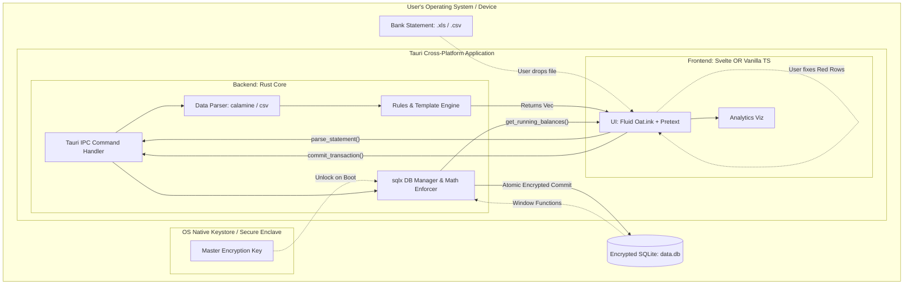

# MASTER BLUEPRINT: Local-First Personal Finance App

**Project Objective:** A local-first, crash-proof desktop application (with future mobile cross-platform support) designed for robust double-entry accounting. It specifically targets non-US/EU users by prioritizing fault-tolerant Excel/CSV bank statement imports over fragile API scraping.

## 1. ARCHITECTURE & TECH STACK

This application relies on a strict separation of concerns. The Rust backend acts as an "iron-clad sandbox" that absorbs malformed data and protects the encrypted SQLite database, while the frontend provides a high-density, fluid native-feeling UI.

- **Runtime:** Tauri (v2) - Tiny footprint, cross-platform (Desktop + future iOS/Android mobile targets).

- **Backend:** Rust

- **Database:** SQLite (embedded, local, row-based OLTP) encrypted via `sqlcipher`.

- **Frontend Package Manager:** `pnpm` (Strictly Enforced).

- **Styling & Components:** Oat.ink (<https://oat.ink/components/>) - Minimal, accessible components. Plain CSS utilizing fluid/relative units (No Tailwind).

- **Layout/Text Reflow:** `pretext` (<https://github.com/chenglou/pretext>) to guarantee precise typographic reflowing across varying screen sizes.

- **Key Rust Crates:** `calamine` (Excel), `csv`, `sqlx` (Compile-time SQL), `serde`, `regex`, `keyring` (OS Keystore), `sqlcipher`.

### 1.1 Frontend Architectural Paths (Choose One)

The backend API contract (Tauri IPC) is identical for both paths.

- **Path A: The Reactive Path (Svelte)**

  - **Framework:** Svelte 5 + TypeScript

  - **Data Visualization:** SveltePlot

  - **Pros:** Svelte handles the complex UI state changes in the Triage grid automatically.

- **Path B: The Minimalist Path (Vanilla TS + Micro-libs)**

  - **Framework:** Vanilla TypeScript + HTML

  - **Routing:** `tinyrouter.js` (\~950b)

  - **Data Visualization:** Apache ECharts or uPlot

  - **Oat Extensions:** `oat-upload`, `oat-table`, `oat-chips`, `oat-animate`.

  - **Zero-Dep Utilities:** `floatype.js`, `highlighted-input.js`, `dragmove.js`.

  - **Pros:** Zero framework overhead, absolute smallest binary size.

### 1.2 System Architecture Diagram



## 2. SECURITY & PRIVACY BEST PRACTICES

The application adheres to a Zero-Trust and Defense-in-Depth model, assuming all ingested files and local environments could be compromised.

- **Encryption at Rest:** The SQLite database is strictly encrypted using AES-256 via `sqlcipher`. Financial data is never stored in plaintext on the disk.
- **Native Key Management:** The master password/encryption key is NEVER stored in a config file or `localStorage`. Rust securely interfaces with the OS-level credential manager (Keychain on macOS, Credential Manager on Windows, Secret Service on Linux, Keystore on Android) using the `keyring` crate.
- **Zero-Trust Parsing:** Bank statements (Excel/CSV) are treated as hostile input. Parsers must fail safely, preventing memory leaks, buffer overflows, or injection attacks during data triage.
- **Data in Motion:** All IPC communication happens entirely locally within the Tauri memory space. If future network plugins are added, TLS 1.3 is strictly mandated.

## 3. DATABASE SCHEMA & RULES (Pure SQLite)

The schema enforces strict double-entry accounting. V1 is single-currency. Floating-point math is strictly forbidden (currency stored as integers).

```sql
-- 1. ACCOUNTS
CREATE TABLE accounts (
    id TEXT PRIMARY KEY,
    name TEXT NOT NULL,
    type TEXT NOT NULL CHECK(type IN ('asset', 'liability', 'equity', 'revenue', 'expense')),
    commodity TEXT NOT NULL DEFAULT 'INR'
);

-- 2. TRANSACTIONS
CREATE TABLE transactions (
    id TEXT PRIMARY KEY,
    date TEXT NOT NULL,
    payee TEXT NOT NULL,
    notes TEXT
);

-- 3. POSTINGS
CREATE TABLE postings (
    id TEXT PRIMARY KEY,
    transaction_id TEXT NOT NULL REFERENCES transactions(id) ON DELETE CASCADE,
    account_id TEXT NOT NULL REFERENCES accounts(id),
    amount INTEGER NOT NULL,
    commodity TEXT NOT NULL DEFAULT 'INR'
);

CREATE INDEX idx_postings_transaction ON postings(transaction_id);
CREATE INDEX idx_postings_account ON postings(account_id);
CREATE INDEX idx_transactions_date ON transactions(date);

```

**The Balancing Rule:** Before committing, Rust MUST enforce that `SUM(amount) = 0` for every transaction.

## 4. THE "CRASH-PROOF" IMPORT PIPELINE

### 4.1 Declarative Import Templates (TOML)

Rust evaluates TOML templates to extract data. TOML is explicitly chosen over JSON to eliminate "Regex escape hell" by utilizing literal strings (`'...'`), supporting inline comments, and making multi-leg postings highly readable via arrays of tables (`[[...]]`).

_Example: Form 26AS (TDS) Template_

```toml
template_name = "Form 26AS TDS"
schema_alignment = "sahamati_tax_v1"

[date]
column = "Date of Transaction"
format = "%d/%m/%Y"

[payee]
column = "Deductor Name"

[notes]
type = "composite"
format = "TDS Section {section} | TAN: {tan}"

[notes.fields]
section = "Section"
tan = "TAN of Deductor"

# Example showing TOML's superpower: Literal Strings for Regex
[[extractors]]
description = "Extract Payee from complex UPI strings"
source_column = "Details"
# Using single quotes means \d and \s don't need to be escaped like in JSON!
regex = 'UPI/(?:DR|CR)/\d+/([^/]+)'
target_field = "payee"

# Multi-leg postings as an array of tables
[[postings_rules.legs]]
description = "Gross Income"
amount_column = "Amount Paid/Credited"
direction = "credit"
default_account = "Income:Salary"

[[postings_rules.legs]]
description = "Tax Deducted"
amount_column = "Tax Deducted"
direction = "debit"
default_account = "Asset:Taxes:TDS_Receivable"

[[postings_rules.legs]]
description = "Net Cash to Bank"
amount_column = "auto_balance"
direction = "debit"
default_account = "Asset:Checking"

```

### 4.2 Auto-Categorization

1. **Explicit Rules:** Processed via Regex (mapped in TOML).
2. **Implicit Learning:** Fast, local Naive Bayes classifier querying SQLite history.

### 4.3 The Data Contract (`ParsedRow`)

Rust maps every row to this Enum and sends it via Tauri IPC. It never panics on bad data.

```rust
#[derive(Serialize)]
#[serde(tag = "status")]
pub enum ParsedRow {
    Valid { row_idx: usize, date: String, payee: String, amount: i64, target_account_id: String },
    Invalid { row_idx: usize, raw_data: String, error_reason: String }
}

```

## 5. UI/UX SPECIFICATION (Fluid & Mobile-Ready)

The UI must be entirely fluid. Hardcoded pixel dimensions are forbidden to ensure a seamless transition to Tauri's mobile targets (iOS/Android).

- **Global Layout:** Uses percentages (`%`), fractions (`fr`), and viewport units (`vw`/`vh`).
- **Sidebar:** Reflows from a fractional side-panel on desktop to a hidden/bottom-tab navigation on smaller mobile viewports.
- **Typography & Content Scaling:** Managed via `pretext` to ensure text scales and wraps predictably across devices without breaking oat.ink components.
- **Triage Data Grid:** UI renders `Vec<ParsedRow>` using `oat-table`. Invalid rows are highlighted for human-in-the-loop correction.

## 6. REJECTED ARCHITECTURES & REFERENCES

To maintain the project's focus, the following technologies were explicitly evaluated and rejected:

- **Tailwind CSS & Fixed Pixels:** Stripped out in favor of the minimalistic `oat.ink` component library and fluid/percentage-based layouts.
- **npm/yarn/bun:** Disallowed. Only `pnpm` is permitted.
- **TigerBeetle & hledger:** Dual-database sync architectures cause fragile race conditions. Rejected for pure local SQLite.
- **Account Aggregator APIs & ML Models:** Cloud dependencies and binary bloat rejected in favor of local parsing and statistics.

### Links & Context

- **Oat.ink Components & Extensions:** `https://oat.ink/components/`, `https://oat.ink/extensions/`
- **Zero-Dep Libs:** `tinyrouter.js`, `floatype.js`, `highlighted-input.js`, `dragmove.js`
- **Pretext:** `https://github.com/chenglou/pretext` (Typography/reflow handling).
- **Paisa:** `https://github.com/ananthakumaran/paisa` (Inspiration for UI, lesson on text-to-SQL sync fragility).
- **TigerBeetle:** `https://tigerbeetle.com/` (Inspiration for strict correctness).
- **SveltePlot:** `https://svelteplot.dev/` (Grammar of graphics for Analytics).
- **Sahamati Standards:** `https://github.com/Sahamati/account-aggregator-standards` (Source of truth for Indian financial schema mapping).
