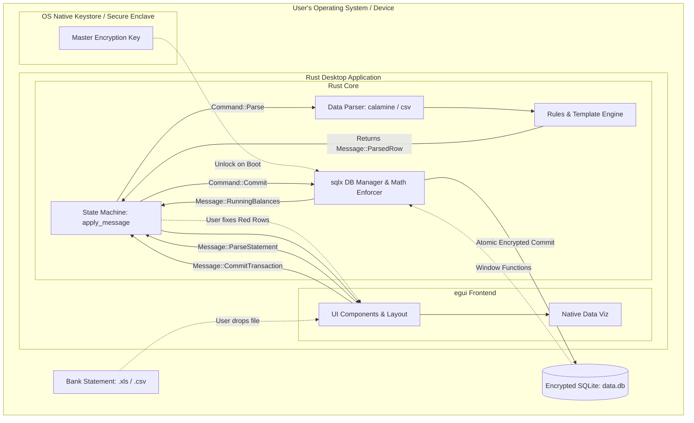

# MASTER BLUEPRINT: Local-First Personal Finance App

**Project Objective:** A local-first, crash-proof desktop application (with future mobile cross-platform support) designed for robust double-entry accounting. It specifically targets non-US/EU users by prioritizing fault-tolerant Excel/CSV bank statement imports over fragile API scraping.

## 1. ARCHITECTURE & TECH STACK

This application relies on a strict separation of concerns. The pure Rust stack acts as an "iron-clad sandbox" that absorbs malformed data and protects the encrypted SQLite database, while the `egui` frontend provides a high-density, fluid native UI.

- **Runtime:** Native Rust Executable
- **Frontend Framework:** `egui` (Immediate Mode GUI)
- **Database:** SQLite (embedded, local, row-based OLTP) encrypted via `sqlcipher`.
- **Package Manager:** `cargo`
- **Key Rust Crates:** `eframe`, `tokio`, `calamine` (Excel), `csv`, `sqlx` (Compile-time SQL), `serde`, `regex`, `keyring` (OS Keystore), `sqlcipher`.

### 1.1 Frontend Architecture

- **State:** Deterministic, unidirectional state machine.
- **Rendering:** `egui` immediate mode drawing loops purely projected from immutable state.
- **Side Effects:** Asynchronous tasks run on `tokio` and resolve to state `Message` updates.

### 1.2 System Architecture Diagram



## 2. SECURITY & PRIVACY BEST PRACTICES

The application adheres to a Zero-Trust and Defense-in-Depth model, assuming all ingested files and local environments could be compromised.

- **Encryption at Rest:** The SQLite database is strictly encrypted using AES-256 via `sqlcipher`. Financial data is never stored in plaintext on the disk.
- **Native Key Management:** The master password/encryption key is NEVER stored in a config file. Rust securely interfaces with the OS-level credential manager (Keychain on macOS, Credential Manager on Windows, Secret Service on Linux) using the `keyring` crate.
- **Zero-Trust Parsing:** Bank statements (Excel/CSV) are treated as hostile input. Parsers must fail safely, preventing memory leaks, buffer overflows, or injection attacks during data triage.

## 3. DATABASE SCHEMA & RULES (Pure SQLite)

The schema enforces strict double-entry accounting. V1 is single-currency. Floating-point math is strictly forbidden (currency stored as integers).

```sql
-- 1. ACCOUNTS
CREATE TABLE accounts (
    id TEXT PRIMARY KEY,
    name TEXT NOT NULL,
    type TEXT NOT NULL CHECK(type IN ('asset', 'liability', 'equity', 'revenue', 'expense')),
    commodity TEXT NOT NULL DEFAULT 'INR'
);

-- 2. TRANSACTIONS
CREATE TABLE transactions (
    id TEXT PRIMARY KEY,
    date TEXT NOT NULL,
    payee TEXT NOT NULL,
    notes TEXT
);

-- 3. POSTINGS
CREATE TABLE postings (
    id TEXT PRIMARY KEY,
    transaction_id TEXT NOT NULL REFERENCES transactions(id) ON DELETE CASCADE,
    account_id TEXT NOT NULL REFERENCES accounts(id),
    amount INTEGER NOT NULL,
    commodity TEXT NOT NULL DEFAULT 'INR'
);

CREATE INDEX idx_postings_transaction ON postings(transaction_id);
CREATE INDEX idx_postings_account ON postings(account_id);
CREATE INDEX idx_transactions_date ON transactions(date);

```

**The Balancing Rule:** Before committing, Rust MUST enforce that `SUM(amount) = 0` for every transaction.

## 4. THE "CRASH-PROOF" IMPORT PIPELINE

### 4.1 Declarative Import Templates (TOML)

Rust evaluates TOML templates to extract data. TOML is explicitly chosen over JSON to eliminate "Regex escape hell" by utilizing literal strings (`'...'`), supporting inline comments, and making multi-leg postings highly readable via arrays of tables (`[[...]]`).

### 4.2 Auto-Categorization

1. **Explicit Rules:** Processed via Regex (mapped in TOML).
2. **Implicit Learning:** Fast, local Naive Bayes classifier querying SQLite history.

### 4.3 The Data Contract (`ParsedRow`)

Rust maps every row to this Enum and state mutations. It never panics on bad data.

```rust
#[derive(Debug, Clone)]
pub enum ParsedRow {
    Valid {
        row_idx: usize,
        date: String,
        payee: String,
        amount: i64,
        commodity: String,
        suggested_account_id: Option<String>,
        confidence: f32,
    },
    Invalid {
        row_idx: usize,
        raw_data: String,
        error_reason: String,
    }
}

```

## 5. UI/UX SPECIFICATION (egui Desktop Native)

The UI must be entirely fluid and responsive, rendered via `egui` panels and layouts.

- **Global Layout:** Uses `egui::CentralPanel` and side panels for dynamic resizing.
- **Triage Data Grid:** UI renders `Vec<ParsedRow>` using `egui_extras::TableBuilder`. Invalid rows are highlighted for human-in-the-loop correction.

## 6. REJECTED ARCHITECTURES & REFERENCES

To maintain the project's focus, the following technologies were explicitly evaluated and rejected:

- **Tauri & Web Frameworks (SolidJS/React):** Initially considered but replaced to achieve the absolute smallest binary footprint and fastest native UI via pure Rust and `egui`.
- **npm/yarn/pnpm:** Disallowed. Only `cargo` is permitted.
- **TigerBeetle & hledger:** Dual-database sync architectures cause fragile race conditions. Rejected for pure local SQLite.
- **Account Aggregator APIs & ML Models:** Cloud dependencies and binary bloat rejected in favor of local parsing and statistics.

### Links & Context

- **TigerBeetle:** `https://tigerbeetle.com/` (Inspiration for strict correctness).
- **Sahamati Standards:** `https://github.com/Sahamati/account-aggregator-standards` (Source of truth for Indian financial schema mapping).
