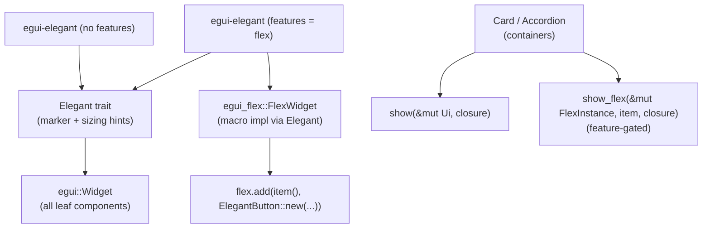

# egui-elegant

A beautiful, minimal, and elegant UI component library for `egui`. Designed with inspiration from modern web component libraries (like oat, shadcn/ui, and daisyUI) and brought to immediate-mode Rust.

## Features

- **Rich Aesthetics**: Pre-configured colors, dark/light modes, glassmorphism, and micro-animations.
- **Unified `Elegant` Trait**: All components implement the `Elegant` marker trait.
- **Optional `egui_flex` Integration**: When the `flex` feature is enabled, all components automatically become `FlexWidget`s and can be directly placed inside `Flex::horizontal()` or `Flex::vertical()` containers.
- **Responsive Sizing**: Sizing models similar to CSS limits (`min_width`, etc.) encoded directly into components natively for layout predictability.

## Setup

Add the following to your `Cargo.toml`:

```toml
[dependencies]
egui = "0.35"

# Basic usage
egui-elegant = { version = "0.1" }

# Or with egui_flex integration:
egui-elegant = { version = "0.1", features = ["flex"] }
```

Initialize the theme in your eframe app:

```rust
use egui_elegant::{ElegantTheme, ThemeMode, MonaspaceFont};

// Inside app setup:
let theme = ElegantTheme::build(ThemeMode::System, MonaspaceFont::Neon);
theme.apply(&cc.egui_ctx);
```

## Architecture

The `Elegant` trait ties the library together. Leaf components (like buttons, progress bars) implement both `egui::Widget` and `Elegant`. Container components (like `Card`, `Accordion`) provide custom `.show()` closures.



## Examples

Run the showcases to see all components in action:

```bash
# Showcase with native egui layouts
cargo run --example showcase_noflex

# Showcase with egui_flex based wrapping layouts
cargo run --example showcase --features flex
```
